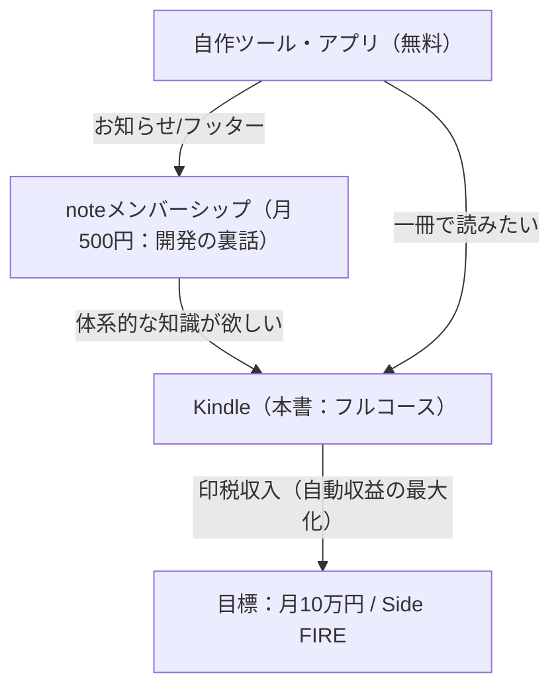

# Kindle書籍構成・目次設計図（改定版）

ブログ（試食版）のIT用語解説と、note（厨房裏・一次データ）の開発ストーリーをマージし、体系化した「フルコース」としてパッケージングするためのKindle書籍の構成案です。
「料理店」の過剰な例え話を排除し、**「メモリ8GBの個人開発」**を軸とした、よりシンプルで実用的な構成へリファクタリングしました。

---

## 📘 書籍概要

* **想定タイトル案**: 『メモリ8GBから始めた個人開発：初心者のためのIT用語とシステム運用のリアルな裏舞台』
* **ターゲット**: 
  * IT用語が難しくて挫折したノンエンジニア・初心者。
  * 「自分だけの個人開発サービスを作ってみたい」と夢見る初心者開発者。
* **書籍の提供価値**: 
  * 難しいIT用語の本質が、回りくどい例え話を抜きにしてスッキリ理解できる。
  * ネットの成功法則には書かれていない、個人開発のリアルな「もがき」と「システム運用の現場」を追体験できる。

---

## 🧭 全体構成（目次）

### 🍕 はじめに
* 完璧なマシンスペックも、豊富な知識もなくていい。手元にあるもので始めよう。
* 一人称「私」で語る、acompany_styleによる読者へのエール。

---

### 💻 第一部：初心者のための「IT用語とシステムの本質」
（ブログ『試食版』の解説をさらに加筆・図解し、各用語の現場でのリアルを深掘りした章）

#### 第1章：CI/CD ── エラーチェックと公開の自動化
* **解説**: 自動テスト（CI）と自動公開（CD）の基本。
* **深掘り（Kindle限定）**: もしCI/CDを導入しなかったら、現場でどのような「悲劇（404エラー、本番データ消失）」が起きるのか、具体的なヒヤリハット事例と手動デプロイの限界。

#### 第2章：サーバーとドメイン ── ネット上の「土地」と「看板」
* **解説**: Xserverとお名前.comを例にした、サーバーとドメインの紐付け。
* **深掘り（Kindle限定）**: レンタルサーバーとクラウド（AWS等）の使い分け。個人開発において最初はレンタルサーバーで十分な技術的理由。

#### 第3章：データベース と SQL ── 大量のデータを高速で整理する仕組み
* **解説**: データの保管場所（DB）と、そこからデータを取り出す命令文（SQL）の基本。
* **深掘り（Kindle限定）**: バックアップを自動化する重要性と、データ消失を防ぐ設計。

#### 第4章：API ── 外部の強力なシステムを間借りする窓口
* **解説**: Google Playの認証機能など、他社の提供する機能を自分のツールに組み込む仕組み。
* **深掘り（Kindle限定）**: APIの仕様変更（エラー）が発生した際、ツールを守るためのエラーハンドリングの重要性。

---

### 🛠️ 第二部：メモリ8GBから始めた「個人開発もがき日記」
（noteの有料記事やプロセス発信をベースに、開発ストーリーを再構成・体系化したドキュメンタリー章）

#### 第5章：スペック不足という「最高の制約」
* メモリ8GBの古いWindows PCで、何ができるかを考え抜いた日々。
* 機能を諦めることで見えてきた「ユーザーの本当のニーズ」。

#### 第6章：初めてのツールが世に放たれた日
* 「Playポイント計算機」リリース当時の緊張と、最初のユーザーが訪れた瞬間の震えるような喜び。
* 完璧を求めるのをやめたとき、個人開発は回り始める。

#### 第7章：月3,000円を「自動化」する仕組み
* XserverとGitHub Actionsを繋いだ「安全な上書きデプロイ」の具体的な設計思想。
* アップデート以外はほぼ手放しで運用するために行ったこと。

#### 第8章：綺麗ごと抜きのリアル収益データ
* アクセス数（PV）とAdSense/AdMob収益のリアルな数字の推移。
* どんな施策が効果的で、何が無駄だったのかのリアルな教訓。

---

### ☕ おわりに
* Side FIREを目指す旅路は、まだ始まったばかり。
* 一緒に次の企画で遊びましょう。
* **【締めの常套句】**:
  > 駄菓子菓子！……（Kindle版アレンジを加えつつ、かたかた様らしい暖かみのあるメッセージで締める）

---

## 📈 マネタイズへの循環（不労所得化への設計）

