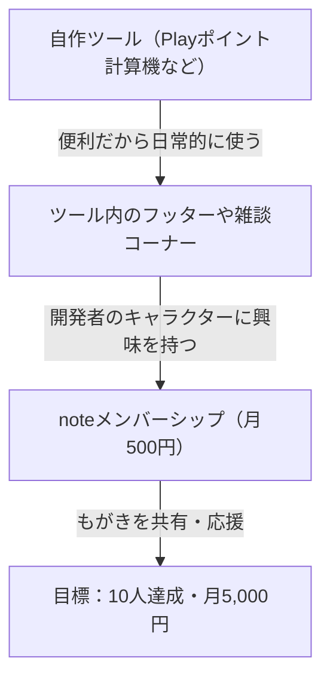

# 歌詞メンバーシップ構築戦略レポート

かたかた様の目標である「Side FIRE（最小限の軽作業で自動収益を獲得）」に最適化し、運用コストを劇的に下げつつ、メンバーの満足度を維持するための現実的な戦略設計図です。

---

## 1. 運用モデルの抜本的改善（持続可能なベストプラクティス）

当初案では「毎週のコラム、お題作詞、AI音源や朗読音声」を特典としていましたが、これでは月5,000円のために膨大な時間を拘束される「過酷な労働」になってしまいます。
持続可能な自動収益モデルにするため、以下のように設計を変更します。

* **更新頻度の緩和**: 毎週更新から**「隔週更新（月2回）」**に半減させます。
* **特典の「確約」から「オプション」への変更**: 音声の公開やオーダーメイド作詞は、毎回の確約特典ではなく、「気が向いた時の不定期イベント」に格下げし、執筆負担を激減させます。

---

## 2. 月500円プランの現実的な特典設計

かたかた様が「日々の開発やブログの合間に、趣味の延長として無理なく続けられる」ことを最優先した設計です。

| 特典名 | 頻度 | 内容 | 運営の負担 |
| :--- | :--- | :--- | :--- |
| **① 創作の足跡（コラム）** | **月2回（隔週）** | 歌詞の原案、ボツ案、言葉選びの推敲プロセスをエッセイとして公開。 | 低（日々のノートの書き起こしのみ） |
| **② 脳内設定資料集** | **不定期** | 歌詞のテーマとなった世界観やキャラクター設定の公開。 | 低（既存のメモの整理のみ） |
| **③ メンバー限定掲示板** | 随時 | 掲示板でのゆるい雑談や、たまにお題を募集する程度の交流。 | 極低（気が向いた時の返信のみ） |

---

## 3. ⚠️ AI歌唱・朗読ツールの商業利用ライセンス要件

将来的にAI歌唱ツール（Suno AIやUdio等）や合成音声・朗読ツールを利用して限定音源を公開・販売する場合、以下の規約を厳守する必要があります。

* **無料プランでの商用利用は厳禁**:
  * 多くのAI生成サービスは、無料プランで作成した音源を「有料エリア（メンバーシップ等）」で公開することを禁止しています（商用利用規約違反）。
* **対策**:
  * 音源を掲載する際は、必ず**該当AIサービスの「有料プラン（商用ライセンス付き）」を契約している期間中に生成した音源**を使用すること。
  * ライセンスを確保できない場合、初期フェーズでは音源の添付は一切行わず、**「テキスト（歌詞と推敲エッセイ）」のみで勝負する**こと（これが最も安全でコストがかかりません）。

---

## 4. 集客導線の適正化（ツールからの流入）

IT用語ブログの読者は「技術の答え」を求めており、歌詞や個人開発の裏話への興味は極めて低いです。
最も現実的で効果的な集客導線は**「自作ツール（Playポイント計算機等）の利用ページ」**です。

* **理由**: ツールを日常的に「便利だ」と思って使っているユーザーは、すでに開発者に対して好意的な感情（ロイヤリティ）を抱き始めています。「この便利なツールを作った人は、どんな環境で、どんなもがきを経て作ったのだろう？」という興味が生まれやすいため、最もnoteへの転換率（CVR）が高くなります。
