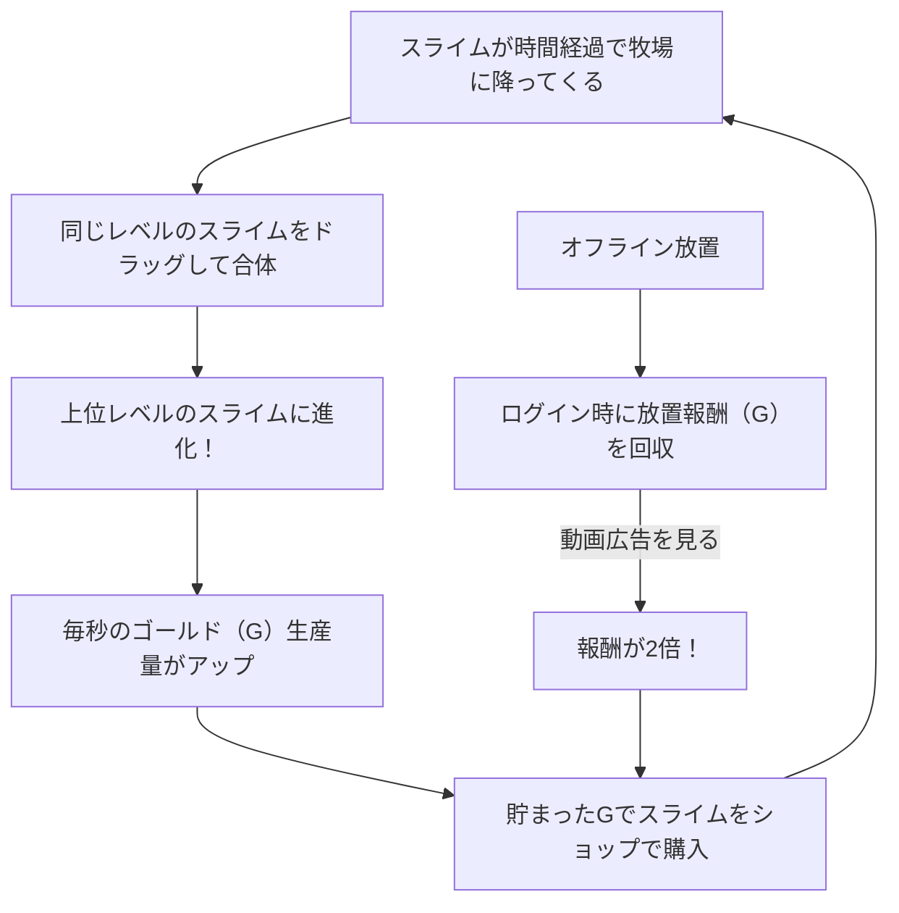

# 「マージ・スライム牧場」ゲーム仕様書

本作は、同じレベルのスライムをスワイプで合体（マージ）させて進化させ、牧場を豊かにしていくインフレ系放置パズルゲームです。かたかた様の開発環境（Web/Android）でサクサク動作し、ポップで心地よいビジュアルと高い中毒性を両立させるための詳細設計です。

---

## 🎨 1. ビジュアル ＆ UIデザイン設計

モバイルでの操作性と、日本のプレイヤーが親しみやすい「情報密度が高めでポップなUI」を両立した画面設計です。

### 📱 画面構成の基本ルール
* **フォント**: `Noto Sans JP`（ポップ・丸ゴシック系をCSS/アプリ側で指定）
* **配色**: パステルカラー（ミントグリーン、ベビーピンク、スカイブルー、レモンイエロー）を基調とした、優しく明るいポップ調。
* **ボタンデザイン**: 角が丸く、タップすると「ぷにっ」と凹むような微細なアニメーションを設定。

---

## 🧭 2. ゲームの基本ループ

---

## 👾 3. スライムの進化ツリー ＆ キャラクター設定（Lv 1〜10）

スライムたちは合体するたびに、より個性的でポップな見た目に進化し、生産するゴールド（G）がインフレしていきます。

| レベル | スライム名 | デザイン特徴（ポップ＆カラフル） | 毎秒生産量 |
| :--- | :--- | :--- | :--- |
| **Lv.1** | **ぷにぷにドロップ** | 水色のしずく型。たまにパチパチ瞬きをする。 | 1 G/秒 |
| **Lv.2** | **ふたばスライム** | 黄緑色。頭のてっぺんから小さな双葉が生えている。 | 3 G/秒 |
| **Lv.3** | **いちごベリー** | 赤いイチゴ柄。ヘタが帽子のようになっている。 | 8 G/秒 |
| **Lv.4** | **ハニーバブル** | 黄色と白の縞模様。ハチの羽が付いており、少し浮いている。 | 20 G/秒 |
| **Lv.5** | **ソーダフロート** | 透明感のあるブルー。頭にチェリーとホイップクリーム。 | 50 G/秒 |
| **Lv.6** | **キャンドルナイト** | 紫色。頭のてっぺんに小さなキャンドルの炎が灯っている。 | 130 G/秒 |
| **Lv.7** | **マジカルクラウン** | ピンク色。キラキラ光る小さな金色の王冠を斜めにかぶっている。 | 350 G/秒 |
| **Lv.8** | **スペースコスモ** | 宇宙柄（グラデーション）。土星のようなリングが周囲を回る。 | 1,000 G/秒 |
| **Lv.9** | **ゴールドフィーバー** | 眩しい金色。サングラスをかけていて常にニヤリと笑っている。 | 3,000 G/秒 |
| **Lv.10** | **レインボーキング** | 虹色に光る。大きなヒゲとふかふかのマントを羽織っている。 | 10,000 G/秒 |

---

## ✨ 4. ポップさを極める「3大演出エフェクト」

プレイヤーが画面を触っているだけで「気持ちいい」と感じるための、Web（CSS/Canvas）やアプリで実装可能な軽量エフェクトです。

### ぷるぷる物理リアクション
* **演出**: スライムをドラッグして指を離したとき、着地時に「縦に潰れて横に伸びる」ような弾力のあるバウンド（Squash & Stretch）をアニメーション（イージング）で再現。

### スパークル・マージ（合体時）
* **演出**: 合体した瞬間に、スライムの周囲に「星くず」や「シャボン玉」のパーティクルがシュッと飛び散るエフェクト。効果音は「ぽんっ！」「ピキーン！」といった小気味いいポップな音。

### コインフィーバー
* **演出**: スライムがゴールドを産み出す際、数字の「+10G」というポップなテキストが上に向かってフワッと浮き上がって消える。

---

## 📈 5. 持続可能なマネタイズ設計（AdMob/AdSense）

かたかた様の自動収益目標（月3,000円〜）を達成するため、プレイヤーにストレスを与えすぎず、かつ再生率の高い広告ポイントを配置します。

* **① ダブル放置報酬（最大マネタイズ）**:
  * アプリ起動時、オフライン中に貯まったゴールドを回収する際、「広告を見て2倍にする」ボタンを設置。ほとんどのプレイヤーが喜んで視聴する最強のポイントです。
* **② フィーバータイム（動画リワード）**:
  * 画面端にある「UFO」や「プレゼント箱」をタップすると動画広告が流れ、視聴完了後に3分間「ゴールドの生産速度が3倍」になる。
* **③ 牧場スロットの拡張**:
  * 最初は12スロット（4x3）から開始し、最大16スロット（4x4）に広げるための拡張条件に「ゴールド」または「動画広告視聴」を設置。
