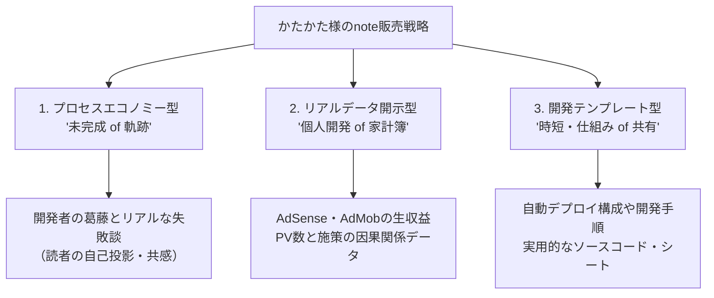
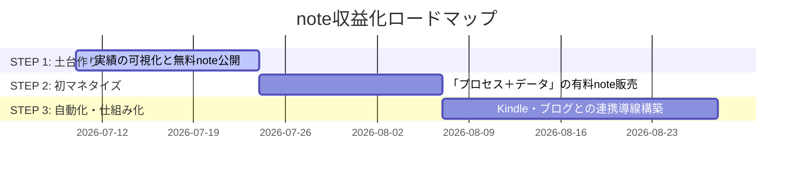

# note収益化・販売戦略レポート

個人開発サークル「はじっこぐらし」および「かたかた」ブランドの価値を最大化し、noteを通じて「安定的かつ自動的な収益（月3,000円〜）」を確立し、将来の「月10万円」「Side FIRE」へと繋げるための販売戦略です。

---

## 1. 現状の辛口レビュー（忖度なしの課題分析）

まずは、現在の発信スタイルとコンテンツモデルにおける「売る」という観点での弱点を厳しく分析します。

### 🚨 課題①：「ファン向け」と「新規購入者向け」の混同
金曜日の「Google Playの日」などの記事は、すでに「かたかた」というキャラクターに愛着を持っているファン向けのコンテンツ（関係性の維持）としては非常に優れています。しかし、**見ず知らずの新規ユーザーが「お金を払ってまで読む動機」としては極めて弱い**です。
* **改善点**: 「無料で読めるファン構築コンテンツ」と、「お金を払ってでも手に入れたいソリューション（解決策）コンテンツ」の役割を明確に分ける必要があります。

### 🚨 課題②：売り物の「独自性（一次情報）」の不足
IT用語解説（ブログ『試食版』 ➔ Kindle『フルコース』）の戦略は素晴らしいですが、単なる「用語の分かりやすい説明」だけで有料noteを売ろうとすると、無料の技術ブログやYouTube、ChatGPTの解説とバッティングします。
* **改善点**: 読者がお金を払うのは「分かりやすい説明」ではなく、**「実際にやってみた一次データ」や「失敗から得た教訓」という、世の中に一つしかないストーリー**です。

### 🚨 課題③：ツールの価値と記事の価値の乖離
「Playポイント計算機」やミニゲームなどの素晴らしいツールがありますが、ツール利用者は「便利だから使う」のであって、「開発者のエッセイを有料で読む」わけではありません。ツールの宣伝と有料noteの販売が直接結びついていません。
* **改善点**: ツール自体は「入り口」または「実績の証明」として使い、noteでは「そのツールをどうやって作ったか」「どうやって運用・マネタイズしているか」という**メタ情報（裏舞台）**を販売ターゲットにします。

---

## 2. noteで「売れる」ための3大コンセプト（商品設計）

かたかた様が提供できる、最も価値が高く競合が真似できない有料コンテンツの切り口を3つ提案します。

### 🎯 コンセプト①：プロセスエコノミー（もがきと葛藤の追体験）
完璧な成功者のノウハウではなく、**「月3,000円、そして10万円の不労所得化を目指してリアルにもがいている過程」**そのものをドキュメンタリーとして販売します。
* **なぜ売れるのか？**: 多くの読者は「自分もSide FIREしたい」「個人開発を始めたい」という願望を持っています。同じ目線で一歩先を行くかたかた様の「生々しい失敗と、そこからの立ち上がり」は、最強の自己投影先（バイブル）になります。
* **書き方の指針**: 
  - 具体的なコードの羅列は避け、読者が「自分のこと」として捉えられるよう、**葛藤や判断の理由の抽象度を高く（余白を残して）書く**。

### 🎯 コンセプト②：一次データ・リアル家計簿の公開
「Playポイント計算機」やその他ツールの「実際のアクセス数（PV）」「AdSense/AdMobの収益推移」「実施したSEO対策の効果」など、**ネット上の一般論ではない生データ**を有料部分に格納して公開します。
* **なぜ売れるのか？**: 個人開発者のリアルな収益データは、喉から手が出るほど欲しい人がいる超貴重な一次情報です。「この施策をやったら収益が〇〇円増えた（減った）」というファクト自体に価格がつきます。
* **構成例**: 
  - 無料部分：施策の背景と仮説、読者への普遍的な問いかけ。
  - 有料部分（ワンコイン等）：具体的な管理画面のスクショ、実際の数値、検証から得たリアルな結論。

### 🎯 コンセプト③：開発スピードを買う「時短テンプレート」
かたかた様が実際に構築した「Xserver ➔ GitHub Actionsを使った安全な上書きデプロイ構成」や、「Cocoonを極限まで軽量化する設定チェックリスト」など、他のWeb制作者やアプリ開発者が**「調べる時間をショートカットできるツール・設定シート」**を販売します。
* **なぜ売れるのか？**: 技術者は「調べる時間（数時間〜数日）」をお金で買います。3,000円で数時間の試行錯誤が省けるなら、それは非常に安い買い物です。

---

## 3. note執筆の黄金ルール（かたかたスタイルとの融合）

有料noteを執筆する際、かたかた様独自の「3つの指針」と「acompany_style」をどう適用するかの具体策です。

| 指針 | 読者が購入したくなる具体的な落とし込み |
| :--- | :--- |
| **1. タイトル** (普遍的な問いかけ) | 単なる「〇〇の作り方」ではなく、**「なぜ私たちは作り始めても途中で挫折してしまうのか？個人開発を『継続』して月3,000円を生み出す設計思想」**のように、読者自身の課題にフォーカスした問いかけにする。 |
| **2. 本文の抽象度** (余白の保持) | 「Kotlinのこの行をこう書き換えて…」という細かい実装はあえて省き、「エラーと3日間対峙した時に、私が捨てたプライド」のように、**読者が自分の開発現場や人生に置き換えて納得できる心の動き（余白）**をメインにする。 |
| **3. テクニック** (自然な言葉) | マーケティング的な煽り文句（「誰でも簡単に月10万！」等）は一切使わず、「泥臭くやった結果がこれです。もし同じ道を歩むなら、私の失敗を踏み台にしてください」という**誠実で情熱的な normal_style / acompany_style** で語る。 |

---

## 4. 収益安定化（月3,000円〜）へのアクションロードマップ

まずは最初の「有料note購入者」を生み出し、リピートしてもらうための3ステップです。

### 【STEP 1】実績と「もがき」の可視化（準備期）
* **行動**: 開発中の様子や、現在の各ツールのステータスを「ストーリー」として週1〜2回発信。
* **狙い**: 読者に「かたかたサークルのプロジェクトの成長を見守る当事者（ファン）」になってもらう。

### 【STEP 2】初の有料（あるいは一部有料）記事のリリース
* **テーマ候補**: `「Windows i5・メモリ8GBの限界環境から、月数千円を自動で稼ぎ出すWebサービス群を構築するまでに諦めたこと・通したこだわり」`
* **価格**: 100円〜300円（手軽に買えるお試し価格）
* **内容**: 無料部分で開発のドラマを語り、有料部分で実際のサーバー構成、Xserver連携の注意点、当時のリアルな作業時間と収益データを公開。

### 【STEP 3】ハブサイト・ブログ・Kindleとの自動循環の構築
* **自動化の仕組み**:
  1. **入り口**: 無料のWebツール（Playポイント計算機など）や「1記事1用語」のブログで新規層を集客。
  2. **ファン化**: ブログやツール内に「開発の裏話はこちら（note）」へのリンクを設置し、noteへ誘導。
  3. **マネタイズ**: noteで「開発プロセス・生データ」を販売しつつ、体系化したノウハウはKindleで「フルコース」として書籍化して販売。
